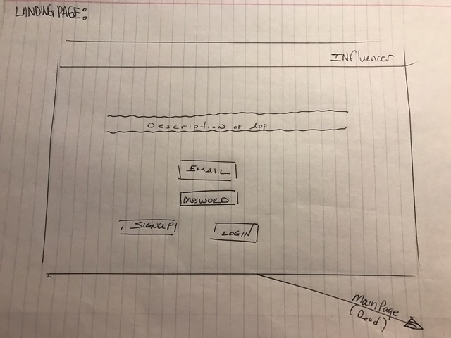

# Influencer

### Description:<b>

Influencer is an application that lets users know whether a retail establishment has a long line, especially useful when bars or restaurants don't take reservations.

A user will sign up for an account and login to input the appropriate location information so other users may view it.  Buttons will be used to make the input process quicker and easy to view and sort.

**Basic *functions* will include:**
- Signup, Login
- Post, Edit post, Delete post
- Delete user account

**Basic *features* will include:**
- Line status logged by button clicks
- Sorting locations by line status
- Privacy controls for user

### User stories:<b>
[Trello](https://trello.com/b/5vEUV6Ga/influencer)

### Wireframes:

### ERD:

### Link to application:
https://nameless-meadow-65615.herokuapp.com/

### Technologies used:
Ruby on Rails
HTML
Heroku
GitHub
Trello

### Approach taken:
1. Created models
2. Created controllers
3. Created views
4. Added login/authorization
5. Updated User/Post functions

### Installation instructions:
1. Clone repository using GitHub
2. Install gems (bundle install)
3. Create and migrate the postgresql database.
4. Open Rails server(Rails S)
5. Open:localhost:3000 in a browser

### Unsolved problems and next steps:
1. FINISH
2. Routes were difficult for me
3. Authenticating who can edit posts
